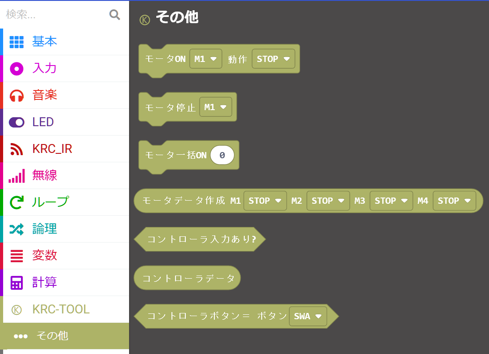
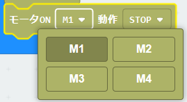
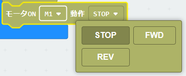
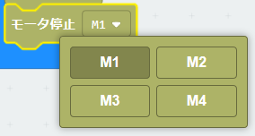
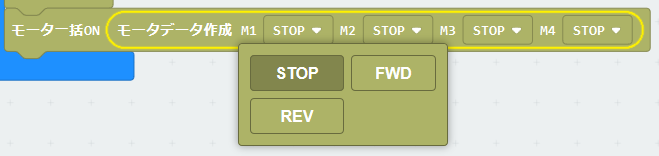
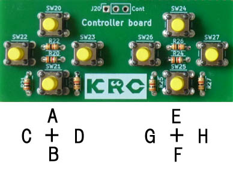
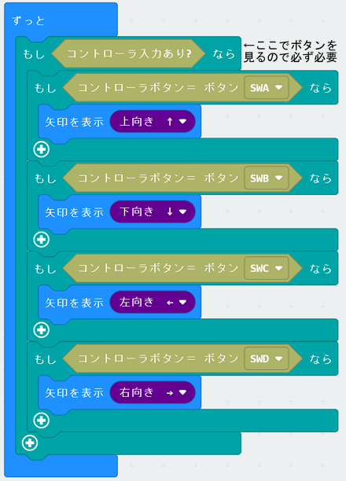

# KRCモータードライバ


## URL
project URL:  ```https://github.com/kukirobotclub/pxt-krc-motor-easy```<BR>
上記のアドレスを拡張機能から張り付けて、拡張ブロックを導入する

## 概要
KRCのマイクロビットボードのモータドライブコントロールの拡張ブロック

・ロボットを動かす直感的なブロックのみサポート

## ブロック

・前にn秒すすむ
・後ろにn秒すすむ
・左にn秒まがる
・右にn秒まがる
・左にn秒回る
・右にn秒回る
・うでをn秒前にまわす
・うでをn秒後ろにまわす
・n秒止まる


## ライセンス

GNU

Bitcom

## 注意点

モーターは以下のポートに接続されているものとする<BR>

・Ch1　P8,P12

・Ch2　P13,P14

・Ch3　P15,P16

・Ch4　P1,P2

よってほかの用途でポートを使う場合は、併用できない<BR>


------

## その他のブロック

その他のメニュー



### 1.モーターON/OFF
<BR>
制御したいモータ番号を選択<BR>
<BR>
回転方向を選択<BR>

### 2.モーター停止
<BR>
停止したいモータ番号を選択<BR>

### 3.モーター一括ON/OFF
<BR>
一度に全モーターのON/OFFを行う<BR>
４つのモーターを一度に設定したいときに１行でできる<BR>
データは「モーター一括データ作成」で作成された形式<BR>

### 4.モーター一括データ作成
<BR>
モーターの一括データを作成する<BR>

### 5.コントローラパッド入力
専用のコントロールパッドの入力を行う<BR>

<BR>

| 選択  | ボタン |      |
| ---- | ------ | ---- |
| SWA  |    A    | 左↑ボタン  |
| SWB  |    B    | 左↓ボタン  |
| SWC  |    C    | 左←ボタン  |
| SWD  |    D    | 左→ボタン  |
| SWE  |    E    | 右↑ボタン  |
| SWF  |    F    | 右↓ボタン  |
| SWG  |    G    | 右←ボタン  |
| SWH  |    H    | 右→ボタン  |

必要なボタンを比較して判断する<BR>

<BR>

